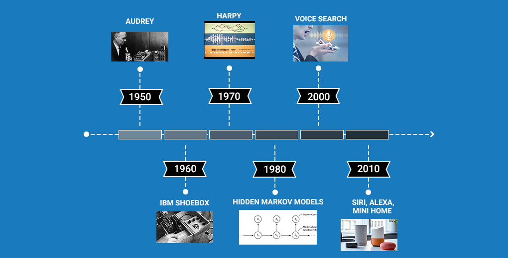
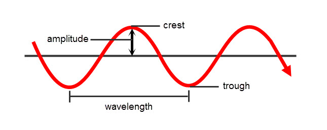
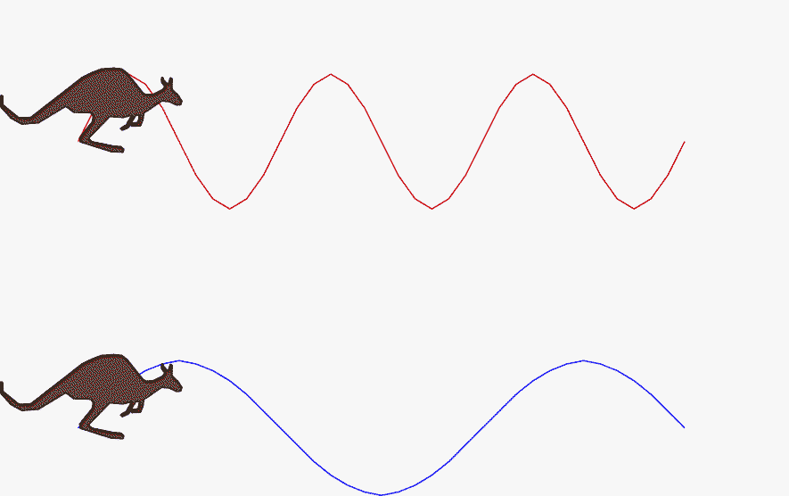
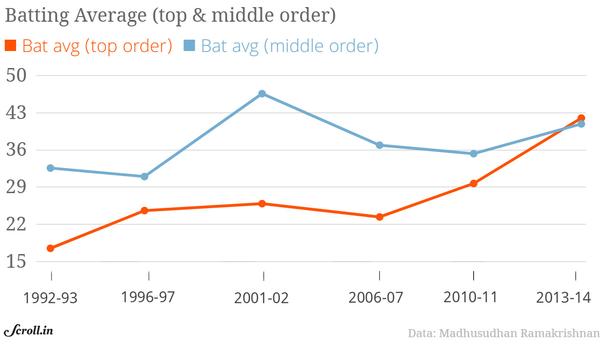
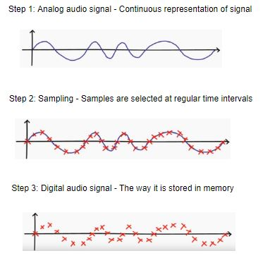
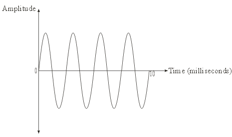
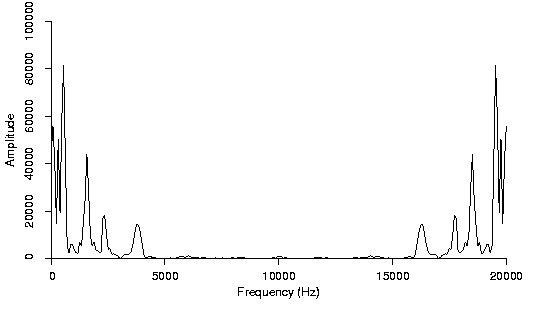

# Speech Recognition

## Table of Contents

* A Brief History of Speech Recognition through the Decades 

* Introduction to Signal Processing 

* Different Feature Extraction Techniques from an Audio Signal

* Understanding the Problem Statement for our speech recognition poject

## A Brief History of Speech Recognition through the Decades

Exploration of speech recognition goes way back to the 1950s. These systems have been around for over 50 years! We have prepared a neat illustrated timeline for you to quickly understand how Speech Recognition systems have evolved over the decades:

* The first speech recognition system, Audrey, was developed back in 1952 by three Bell Labs researchers. Audrey was designed to recognize only digits

* Just after 10 years, IBM introduced its first speech recognition system IBM Shoebox, which was capable of recognizing 16 words including digits. It could identify commands like  “Five plus three plus eight plus six plus four minus nine, total,” and would print out the correct answer, i.e., 17

* The Defense Advanced Research Projects Agency (DARPA) contributed a lot to speech recognition technology during the 1970s. DARPA funded for around 5 years from 1971-76 to a program called Speech Understanding Research and finally, Harpy was developed which was able to recognize 1011 words. It was quite a big achievement at that time.

* In the 1980s, the Hidden Markov Model (HMM) was applied to the speech recognition system. HMM is a statistical model which is used to model the problems that involve sequential information. It has a pretty good track record in many real-world applications including speech recognition. 

* In 2001, Google introduced the Voice Search application that allowed users to search for queries by speaking to the machine.  This was the first voice-enabled application which was very popular among the people. It made the conversation between the people and machines a lot easier. 

* By 2011, Apple launched Siri that offered a real-time, faster, and easier way to interact with the Apple devices by just using your voice. As of now, Amazon’s Alexa and Google’s Home are the most popular voice command based virtual assistants that are being widely used by consumers across the globe. 

## Introduction to Signal Processing

***What is an Audio Signal?***

This is pretty intuitive – any object that vibrates produces sound waves. Have you ever thought of how we are able to hear someone’s voice? It is due to the audio waves. Let’s quickly understand the process behind it.

When an object vibrates, the air molecules oscillate to and fro from their rest position and transmits its energy to neighboring molecules. This results in the transmission of energy from one molecule to another which in turn produces a sound wave.

***Parameters of an audio signal***

* Amplitude: Amplitude refers to the maximum displacement of the air molecules from the rest position

* Crest and Trough: The crest is the highest point in the wave whereas trough is the lowest point

* Wavelength: The distance between 2 successive crests or troughs is known as a wavelength

* Cycle: Every audio signal traverses in the form of cycles. One complete upward movement and downward movement of the signal form a cycle

* Frequency: Frequency refers to how fast a signal is changing over a period of time

The below GIF wonderfully depicts the difference between a high and low-frequency signal:

***Digital signal***

A digital signal is a discrete representation of a signal over a period of time. Here, the finite number of samples exists between any two-time intervals.

For example, the batting average of top and middle-order batsmen year-wise forms a digital signal since it results in a finite number of samples.

***Analog signal***

An analog signal is a continuous representation of a signal over a period of time. In an analog signal, an infinite number of samples exist between any two-time intervals.

For example, an audio signal is an analog one since it is a continuous representation of the signal.

***What is sampling the signal and why is it required?***

An audio signal is a continuous representation of amplitude as it varies with time. Here, time can even be in picoseconds. That is why an audio signal is an analog signal.

Analog signals are memory hogging since they have an infinite number of samples and processing them is highly computationally demanding. Therefore, we need a technique to convert analog signals to digital signals so that we can work with them easily.

***Sampling the signal*** is a process of converting an analog signal to a digital signal by selecting a certain number of samples per second from the analog signal.

I really like the below illustration. It depicts how the analog audio signal is discretized and stored in the memory:

The key thing to take away from the above figure is that we are able to reconstruct an almost similar audio wave even after sampling the analog signal since I have chosen a high sampling rate. The sampling rate or sampling frequency is defined as the number of samples selected per second. 

## Different Feature Extraction Techniques for an Audio Signal

The first step in speech recognition is to extract the features from an audio signal which we will input to our model later. So now, l will walk you through the different ways of extracting features from the audio signal.

***Time-domain***

Here, the audio signal is represented by the amplitude as a function of time. In simple words, it is a plot between amplitude and time. The features are the amplitudes which are recorded at different time intervals.

The limitation of the time-domain analysis is that it completely ignores the information about the rate of the signal which is addressed by the frequency domain analysis.

***Frequency domain***

In the frequency domain, the audio signal is represented by amplitude as a function of frequency. Simply put – it is a plot between frequency and amplitude. The features are the amplitudes recorded at different frequencies.

The limitation of this frequency domain analysis is that it completely ignores the order or sequence of the signal which is addressed by time-domain analysis.

***We can get the time-dependent frequencies with the help of a spectrogram.***

Ever heard of a spectrogram? It’s a 2D plot between time and frequency where each point in the plot represents the amplitude of a particular frequency at a particular time in terms of intensity of color. In simple terms, the spectrogram is a spectrum (broad range of colors) of frequencies as it varies with time. 

The right features to extract from audio depends on the use case we are working with.