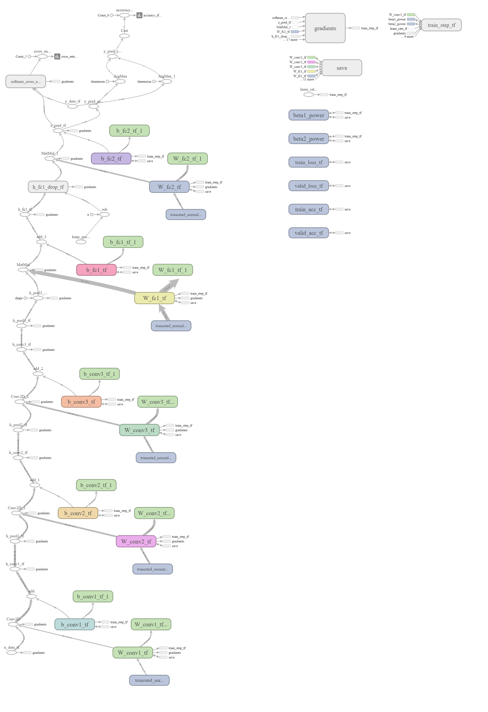

# Train a deep neural network on the MNIST dataset with general approach

***repo consists of 6 parts:***

* csv to image

* main.py

* utils.py

* data loader.py

* BaseNN.py

* DNN.py

## 1. csv to image

For generalization we must assume that our data consists of images saved in appropriate folders, where each folder contains images with the same label as folder name. To that end we have to download MNIST csv dataset and do some preprocessing. We have to convert our downloaded files to normal images and save each class in appropriate directory.

## 2. main

Almost all important parameters for training are defined here. For training the model we should use the following command line: "python3 main.py" (in ubuntu) and "python main.py" (in windows)

## 3. utils.py

All intermediate helper functions are kept here:

* ***create_dir*** - Create new directory if no one exist with the same name
* ***normalize_data*** - this is used, when new images are generated manually
* ***one_hot_to_dense*** - convert one-hot encodings into labels

## 4. data loader

Here we have DataLoader class, which provides data for train/test/validation

* ***load_image*** - takes path of an image as an argument and generate its matrix and label (one-hot) i.e. read the image from its path

* ***batch_data_loader*** - takes index as an argument and return the batch of images from specified list of paths of images (train, val, test) corresponding to that index

* ***train_data_loader***, ***test_data_loader***, ***val_data_loader*** - call batch_data_loader with appropriate argument

* ***get_train_data_size***, ***get_test_data_size***, ***get_val_data_size*** - return data size which can be used in training

* ***all_train_data_loader***, ***all_test_data_loader***, ***all_val_data_loader*** - return all data by calling batch_data_loader with batch_size = data_size

## 5. BaseNN

BaseNN abstract class is defined here. In this class we have everything we need for training except of ***network*** and ***metrics***
This two methods are abstract (see descriptions in the next chapter)

* ***generate_images*** - takes images as argument and generate new images via rotations, translations, zoom using keras

* ***summary_variable*** - attach summaries to a tensor for TensorBoard visualization

* ***create_network*** - creates whole graph of training:

    * define placeholders for input and labels

    * "compute" prediction of the network

    * "compute" the loss function

    * setup optimizer,

    * setup operation which minimizes loss function
    
* ***attach_summary*** - create summary tensors for tensorboard

* ***train_model_helper*** - helper function to train the model

* ***train_model*** - trains the model passing through data num epochs times, does validation after "validation step" steps, save checkpoint after "checkpoint step" steps and display loss after "display step" steps

* ***save_model*** - save tensors/summaries

* ***forward*** - forward prediction of current graph

* ***load_session_from_file*** - load session from file, restore graph, and load tensors

* ***test_model*** - load model and test on test data

* ***initialize_network*** - load model meta info, which contains all parameters if such info exists

* ***network*** - abstract method, see descriptions in the next chapter

* ***metrics*** - abstract method, see descriptions in the next chapter

Something will be changed here soon.

## 6. DNN

Here we have DNN class, which inherits from BaseNN class. ***network*** and ***metrics*** abstract methods are implemented here, and also some helper methods for code understandability.

* ***weight_variable*** - returns tf.variable and initialize it with random number (stdev = 0.1)

* ***bias_variable*** - returns tf.variable and initialize it with constant 0.1

* ***conv2d*** - takes x and W and performs convolution operation with strides = [1, 1, 1, 1], padding = 'SAME'

* ***max_pool_2x2*** - takes x and performs max pooling 2 x 2, padding = 'SAME'

* ***load_tensors*** - takes graph and initialize network's all parameters according to that graph

* ***network*** - takes an input with shape (batch size; height of image; width of image ; num channels) and gives output with shape (batch size, num classes) using below mentioned architecture.

:-------------------------:

* ***metrics*** - takes actual and predicted values and computes accuracy

